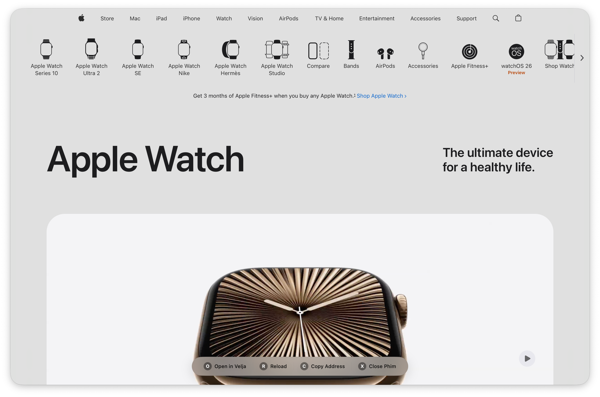

<div align="center">
  
  
  # Phim
  
  [](https://github.com/roelvangils/phim/releases)
  [](LICENSE)
  [](https://www.apple.com/macos/)
  [](https://swift.org)
  [](https://roelvangils.github.io/phim/)
  
  **This is not a browser.**  
  It's an ephemeral reading space. No history. No cookies. No distractions.  
  Perfect companion for [Velja](https://sindresorhus.com/velja) and [Hyperduck](https://sindresorhus.com/hyperduck) workflows.
  
  [**Download**](https://github.com/roelvangils/phim/releases/latest) • [**Website**](https://roelvangils.github.io/phim/) • [**Documentation**](#usage)
</div>

<div align="center">
  
</div>

## Why Phim?

Phim is designed for **ephemeral reading**. Every session starts completely fresh - no cookies, no cache, no history. When you close Phim, it's like it was never there. This makes it perfect for:

- Reading documentation without cluttering your browser
- Checking competitor websites privately
- Viewing sensitive documents
- Quick link previews via Velja or Hyperduck
- Testing websites in a clean environment

## Features

- **Truly Ephemeral**: Every session starts fresh, nothing is saved
- **Minimalist Design**: Borderless window with floating toolbar that appears on hover
- **Intelligent Vibrancy**: Automatically makes light backgrounds transparent for a native macOS look
- **Multiple Input Methods**: 
  - Command-line arguments
  - Piped input
  - Drag and drop
  - Open With context menu
  - Clipboard monitoring
- **Keyboard Shortcuts**:
  - `O`: Open current URL in default browser
  - `R`: Reload page
  - `C`: Copy current URL
  - `X`: Close Phim
  - `⌘⇧V`: Toggle vibrancy
  - `⌘⇧L`: Toggle fancy loading animation
- **Auto-Updates**: Built-in Sparkle framework for automatic updates

## Installation

### Direct Download
Download the latest release from the [Releases](https://github.com/roelvangils/phim/releases) page.

### Build from Source
```bash
git clone https://github.com/roelvangils/phim.git
cd phim
./build.sh
```

## Usage

### From Finder
1. Open Phim.app from Applications folder
2. The app will automatically load URLs from your clipboard when it becomes active

### From Terminal
```bash
# Open a URL
phim https://example.com

# Open a local file
phim /path/to/file.html

# Pipe a URL
echo "https://example.com" | phim
```

### As Default Handler
Right-click any HTML file → Open With → Phim

## Requirements

- macOS 15.0 (Sequoia) or later
- Apple Silicon or Intel Mac

## Development

### Project Structure
```
phim/
├── PhimSource/           # Swift source files
│   ├── PhimApp.swift    # Main application
│   ├── ContentView.swift # UI container
│   ├── WebView.swift    # WebKit wrapper
│   └── welcome.html     # Welcome page
├── build.sh             # Build script
├── generate_sparkle_keys.sh # Sparkle key generation
└── sign_update.sh       # Update signing script
```

### Building
The project uses a custom build script that expects an Xcode project in the `Phim/` subdirectory:
```bash
./build.sh
```

### Creating Updates
1. Generate EdDSA keys (one time only):
   ```bash
   ./generate_sparkle_keys.sh
   ```

2. Build and sign your update:
   ```bash
   ./build.sh
   ditto -c -k --sequesterRsrc --keepParent Phim.app Phim-1.0.1.zip
   ./sign_update.sh 1.0.1 Phim-1.0.1.zip
   ```

3. Update `appcast.xml` with the generated entry
4. Upload both files to GitHub releases

## Privacy

Phim respects your privacy:
- No persistent cookies or cache
- No tracking or analytics
- No data collection
- Each session starts fresh

## License

MIT License - See [LICENSE](LICENSE) file for details

## Contributing

Contributions are welcome! Please feel free to submit pull requests or open issues for bugs and feature requests.

## Author

Created by Roel Van Gils

## Acknowledgments

- Built with Swift and SwiftUI
- Uses [Sparkle](https://sparkle-project.org/) for automatic updates
- Inspired by the need for a focused, distraction-free reading experience on macOS